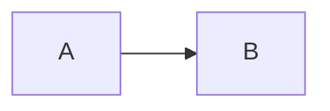

＃ こんにちは 😀Crossnote へようこそ

`@crossnote.auth "lng":"ja-JP"`

あなたはラッキーです！ [0xGG](https://github.com/0xGG)によって密かに開発されている Web サイトを発見しました。

**Crossnote**は、可能であれば将来的に商用化したい最初のプロジェクトです。

現在使用しているエディターは、[0xGG / VickyMD](https://github.com/0xGG/VickyMD)でオープンソース化されており、[@laobubu](https://github.com/の上に構築されていますlaobubu)の素晴らしいプロジェクト[HyperMD](https://github.com/laobubu/HyperMD)。 VickyMD が永遠にオープンソース化されることを願っています。また、今後もこのプロジェクトのフロントエンドおよびバックエンドコードのオープンソース部分を継続していきます。

新しいエディターに** VickyMD **という名前を付け、** HyperMD **を拡張して、[echarts](echartsjs.com)、[plantuml](http://plantuml.com/)、[vega](https://vega.github.io/vega/)、[vega-lite](https://vega.github.io/vega-lite/)、および[wavedrom](https://wavedrom.com/)。一方、このエディターを使用すると、開発者は、先ほど見たサインアップ/ログインウィジェットのように、カスタマイズ可能なウィジェットを開発できます。ただし、将来エディターの完全な書き直しを発行する可能性があります。

[Markdown Preview Enhanced](https://github.com/shd101wyy/markdown-preview-enhanced)を使用したことがある場合、基本的に多くの機能をこの Web サイトに移動したことがわかります（まだ実装されていません） 。たとえば、MPE で行ったのと同じ方法でスライドを作成できます。 `<-slide->`を挿入するだけです。また、さまざまな種類の図、KaTeX 数学、タスクリスト、脚注などを作成できます。

**Crossnote**は、**VickyMD**をコアとして構築されています。 Crossnote は、リアルタイムの共同編集、メモ/タグ管理、チャットグループ、通知などをサポートするマークダウンメモ作成プラットフォームです。メモを友人や一般の人と簡単に共有できます。リンクだけで簡単に他の人にメモを表示することもできます。今後、より多くの機能が実装される予定です。

**Crossnote**はまだ開発中です。現在、本番 Web サイトはロサンゼルスに 8GB の RAM しか搭載していない Vultr VPS で稼働しています。製品はまだ安定していません（基本的に、コードを作成すればするほど、より多くのバグが発生します）。データが安全に保存されるとは限りません。 **繰り返しますが、この製品はまだ準備ができていません**。しかし、あなたが私がそれをテストするのを手伝うことができるならば、私は幸せです。

もっと派手な機能が登場しています;）連絡を取り合いましょう。この製品のテストにご協力いただきありがとうございます。

問題や機能のリクエストがある場合は、[こちら](https://github.com/0xGG/Crossnote/issues)に投稿してください。すぐに返信できない場合はご容赦ください。

---

# Header 1

## Header 2

### Header 3

#### Header 4

##### Header 5

###### Header 6

`inline code`

```javascript
// Code blocks
function add(x, y) {
  return x + y;
}
```

**bold** and _italic_ and ~~strikethrough~~

[link to crossnote issues](http://github.com/0xGG/crossnote_issues)

image:


KaTeX Math:

$\left(\begin{array}{cc} \frac{1}{3} & x\\ {\mathrm{e}}^x & x^2 \end{array}\right)$

$$x^n + y^n = z^n$$

- [ ] Task lists
- [ ] Task lists 2

Mermaid:



PlantUML:

```plantuml
A -> B
```

Echarts:

```echarts
{"xAxis":{"type":"category","boundaryGap":false,"data":["Mon","Tue","Wed","Thu","Fri","Sat","Sun"]},"yAxis":{"type":"value"},"series":[{"data":[820,932,901,934,1290,1330,1320],"type":"line","areaStyle":{}}]}
```

Wavedrom:

```wavedrom
{"signal":[{"name":"clk","wave":"p......"},{"name":"bus","wave":"x.34.5x","data":"head body tail"},{"name":"wire","wave":"0.1..0."}]}
```

Vega:

```vega
{
  "$schema": "https://vega.github.io/schema/vega/v5.json",
  "width": 500,
  "height": 200,
  "padding": 5,

  "data": [
    {
      "name": "table",
      "values": [
        {"x": 0, "y": 28, "c": 0}, {"x": 0, "y": 55, "c": 1},
        {"x": 1, "y": 43, "c": 0}, {"x": 1, "y": 91, "c": 1},
        {"x": 2, "y": 81, "c": 0}, {"x": 2, "y": 53, "c": 1},
        {"x": 3, "y": 19, "c": 0}, {"x": 3, "y": 87, "c": 1},
        {"x": 4, "y": 52, "c": 0}, {"x": 4, "y": 48, "c": 1},
        {"x": 5, "y": 24, "c": 0}, {"x": 5, "y": 49, "c": 1},
        {"x": 6, "y": 87, "c": 0}, {"x": 6, "y": 66, "c": 1},
        {"x": 7, "y": 17, "c": 0}, {"x": 7, "y": 27, "c": 1},
        {"x": 8, "y": 68, "c": 0}, {"x": 8, "y": 16, "c": 1},
        {"x": 9, "y": 49, "c": 0}, {"x": 9, "y": 15, "c": 1}
      ],
      "transform": [
        {
          "type": "stack",
          "groupby": ["x"],
          "sort": {"field": "c"},
          "field": "y"
        }
      ]
    }
  ],

  "scales": [
    {
      "name": "x",
      "type": "band",
      "range": "width",
      "domain": {"data": "table", "field": "x"}
    },
    {
      "name": "y",
      "type": "linear",
      "range": "height",
      "nice": true, "zero": true,
      "domain": {"data": "table", "field": "y1"}
    },
    {
      "name": "color",
      "type": "ordinal",
      "range": "category",
      "domain": {"data": "table", "field": "c"}
    }
  ],

  "axes": [
    {"orient": "bottom", "scale": "x", "zindex": 1},
    {"orient": "left", "scale": "y", "zindex": 1}
  ],

  "marks": [
    {
      "type": "rect",
      "from": {"data": "table"},
      "encode": {
        "enter": {
          "x": {"scale": "x", "field": "x"},
          "width": {"scale": "x", "band": 1, "offset": -1},
          "y": {"scale": "y", "field": "y0"},
          "y2": {"scale": "y", "field": "y1"},
          "fill": {"scale": "color", "field": "c"}
        },
        "update": {
          "fillOpacity": {"value": 1}
        },
        "hover": {
          "fillOpacity": {"value": 0.5}
        }
      }
    }
  ]
}
```

Vega-lite:

```vega-lite
{
  "$schema": "https://vega.github.io/schema/vega-lite/v4.json",
  "description": "A simple bar chart with embedded data.",
  "data": {
    "values": [
      {"a": "A", "b": 28}, {"a": "B", "b": 55}, {"a": "C", "b": 43},
      {"a": "D", "b": 91}, {"a": "E", "b": 81}, {"a": "F", "b": 53},
      {"a": "G", "b": 19}, {"a": "H", "b": 87}, {"a": "I", "b": 52}
    ]
  },
  "mark": "bar",
  "encoding": {
    "x": {"field": "a", "type": "ordinal"},
    "y": {"field": "b", "type": "quantitative"}
  }
}

```
