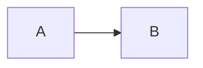

# 你好 😀 欢迎使用 Crossnote 交叉笔记

`@crossnote.auth "lng":"zh-CN"`

你很幸运 😆！你刚刚发现了一个 [0xGG Team](https://github.com/0xGG) 正在悄悄开发的网站。

**交叉笔记**是我在未来如果可能的话第一个想要商业化的项目。

你现在正在使用的这个编辑器是开源项目 [0xGG/VickyMD 微记](https://github.com/0xGG/VickyMD)，她基于 [@laobubu](https://github.com/laobubu) 的很酷的项目 [HyperMD](https://github.com/laobubu/HyperMD) 而构建而成。我希望 VickyMD 可以一直开源下去。并且未来我也会继续开源一部分这个项目的前端和后端代码。

我给予这个编辑器一个名字 **VickyMD**。关于这个编辑器，我扩展了 **HyperMD** 来支持更多的画图例如 [echarts](echartsjs.com)，[plantuml](http://plantuml.com/)，[vega](https://vega.github.io/vega/), [vega-lite](https://vega.github.io/vega-lite/)，以及 [wavedrom](https://wavedrom.com/)。同时，这个编辑器支持开发者来开发可自定义的组件，例如你上面看到的这个登录/注册组件。但是，未来我们有可能会重写这个编辑器。

如果你曾经使用过 [Markdown Preview Enhanced](https://github.com/shd101wyy/markdown-preview-enhanced)，那么你会发现我基本上移植了一些功能到这个网站（虽然还有很多没有移植完成）。例如，你可以像在 MPE 里面创建幻灯片一样在这里创建幻灯片。只需要插入 `<-- slide -->` 就行了。除此之外，你还可以创建各种各样的图表，KaTeX 数学，任务列表，脚注，等等。

**交叉笔记** 是基于 **VickyMD** 为核心编写的。交叉笔记是一款 Markdown 笔记记录平台，支持实时协作编辑，笔记/标签管理，讨论群，通知，等等。你可以很简单地分享你的笔记给你的朋友或者大众。你可以很简单地通过一个链接向别人展示你的笔记。更多的特性将在未来开发完成。

**交叉笔记** 目前处于快速开发状态，她的成产环境的网站只运行在位于洛杉矶的 Vultr 上的一个 8GB 内存的 VPS 上。这个产品目前还不稳定（基本上来讲我写的代码越多，bugs 也越多哈哈），所以你的数据我不保证会被安全地储存。**所以让我重申一下：这个产品目前还没有准备好**。但是我依旧会很高兴如果你能帮我测试下。

更多酷拽炫的特性将被一个一个开发出来 ;) 让我们保持联系。感谢你帮我测试这个产品。

如果你有问题或者特性请求，请发到[这里](https://github.com/0xGG/Crossnote/issues)，如果我没有及时回复还请见谅。

---

# 标题 1

## 标题 2

### 标题 3

#### 标题 4

##### 标题 5

###### 标题 6

`行内代码`

```javascript
// 代码块
function add(x, y) {
  return x + y;
}
```

**粗体** and _斜体_ and ~~删除~~

[链接到 crossnote issues](http://github.com/0xGG/crossnote_issues)

图片：


KaTeX 数学：

$\left(\begin{array}{cc} \frac{1}{3} & x\\ {\mathrm{e}}^x & x^2 \end{array}\right)$

$$x^n + y^n = z^n$$

- [ ] Task lists
- [ ] Task lists 2

Mermaid：



PlantUML：

```plantuml
A -> B
```

Echarts：

```echarts
{"xAxis":{"type":"category","boundaryGap":false,"data":["Mon","Tue","Wed","Thu","Fri","Sat","Sun"]},"yAxis":{"type":"value"},"series":[{"data":[820,932,901,934,1290,1330,1320],"type":"line","areaStyle":{}}]}
```

Wavedrom：

```wavedrom
{"signal":[{"name":"clk","wave":"p......"},{"name":"bus","wave":"x.34.5x","data":"head body tail"},{"name":"wire","wave":"0.1..0."}]}
```

Vega：

```vega
{
  "$schema": "https://vega.github.io/schema/vega/v5.json",
  "width": 500,
  "height": 200,
  "padding": 5,

  "data": [
    {
      "name": "table",
      "values": [
        {"x": 0, "y": 28, "c": 0}, {"x": 0, "y": 55, "c": 1},
        {"x": 1, "y": 43, "c": 0}, {"x": 1, "y": 91, "c": 1},
        {"x": 2, "y": 81, "c": 0}, {"x": 2, "y": 53, "c": 1},
        {"x": 3, "y": 19, "c": 0}, {"x": 3, "y": 87, "c": 1},
        {"x": 4, "y": 52, "c": 0}, {"x": 4, "y": 48, "c": 1},
        {"x": 5, "y": 24, "c": 0}, {"x": 5, "y": 49, "c": 1},
        {"x": 6, "y": 87, "c": 0}, {"x": 6, "y": 66, "c": 1},
        {"x": 7, "y": 17, "c": 0}, {"x": 7, "y": 27, "c": 1},
        {"x": 8, "y": 68, "c": 0}, {"x": 8, "y": 16, "c": 1},
        {"x": 9, "y": 49, "c": 0}, {"x": 9, "y": 15, "c": 1}
      ],
      "transform": [
        {
          "type": "stack",
          "groupby": ["x"],
          "sort": {"field": "c"},
          "field": "y"
        }
      ]
    }
  ],

  "scales": [
    {
      "name": "x",
      "type": "band",
      "range": "width",
      "domain": {"data": "table", "field": "x"}
    },
    {
      "name": "y",
      "type": "linear",
      "range": "height",
      "nice": true, "zero": true,
      "domain": {"data": "table", "field": "y1"}
    },
    {
      "name": "color",
      "type": "ordinal",
      "range": "category",
      "domain": {"data": "table", "field": "c"}
    }
  ],

  "axes": [
    {"orient": "bottom", "scale": "x", "zindex": 1},
    {"orient": "left", "scale": "y", "zindex": 1}
  ],

  "marks": [
    {
      "type": "rect",
      "from": {"data": "table"},
      "encode": {
        "enter": {
          "x": {"scale": "x", "field": "x"},
          "width": {"scale": "x", "band": 1, "offset": -1},
          "y": {"scale": "y", "field": "y0"},
          "y2": {"scale": "y", "field": "y1"},
          "fill": {"scale": "color", "field": "c"}
        },
        "update": {
          "fillOpacity": {"value": 1}
        },
        "hover": {
          "fillOpacity": {"value": 0.5}
        }
      }
    }
  ]
}
```

Vega-lite：

```vega-lite
{
  "$schema": "https://vega.github.io/schema/vega-lite/v4.json",
  "description": "A simple bar chart with embedded data.",
  "data": {
    "values": [
      {"a": "A", "b": 28}, {"a": "B", "b": 55}, {"a": "C", "b": 43},
      {"a": "D", "b": 91}, {"a": "E", "b": 81}, {"a": "F", "b": 53},
      {"a": "G", "b": 19}, {"a": "H", "b": 87}, {"a": "I", "b": 52}
    ]
  },
  "mark": "bar",
  "encoding": {
    "x": {"field": "a", "type": "ordinal"},
    "y": {"field": "b", "type": "quantitative"}
  }
}

```
