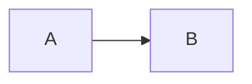

# Hi there 😀 Welcome to Crossnote

`@crossnote.auth "lng":"en-US"`

You are lucky😆! You just discovered a website that is being developed secretly by [0xGG](https://github.com/0xGG).

**Crossnote** is the first project that I would like to commerialize in the future if possible.

The editor that you are using right now is open sourced at [0xGG/VickyMD](https://github.com/0xGG/VickyMD), which is built on top of [@laobubu](https://github.com/laobubu)'s awesome project [HyperMD](https://github.com/laobubu/HyperMD). I hope VickyMD could be forever open sourced. And I will also continue to open source part of the frontend & backend code of this project in the future.

I name the new editor as **VickyMD**, which I extended **HyperMD** to support more diagrams such as [echarts](echartsjs.com), [plantuml](http://plantuml.com/), [vega](https://vega.github.io/vega/), [vega-lite](https://vega.github.io/vega-lite/), and [wavedrom](https://wavedrom.com/). In the meanwhile, this editor allows developers to develop customizable widgets, just like the signup/login widget you just saw above. However, we might issue a complete rewrite of the editor in the future.

If you have ever used [Markdown Preview Enhanced](https://github.com/shd101wyy/markdown-preview-enhanced), you will find that I basically moved many features of it to this website (Still plenty not implemented so far). For example, you can create slide the same way as you did in MPE. Simply insert `<-- slide -->`. Besides, you can create many different kinds of diagrams, KaTeX math, task lists, footnote, etc.

**Crossnote** is built on top of **VickyMD** as its core. Crossnote is a markdown note taking platform that supports real-time collaborative editing, note/tag management, chat groups, notifications, etc. You can easily share your notes with your friends or the public. You can also easily show your note to others just with link. More features will be implemented in the future.

**Crossnote** is still under heavy development, and its production website is currently running on a Vultr VPS with only 8GB ram located in Los Angeles. The product is not stable yet (basically the more I code, the more bugs I produce haha), so your data is not guaranteed to be safely saved. **So let me reiterate: This product is not ready yet**. But I am happy if you could help me test it.

More fancy features are coming out ;) Let's stay in touch. Thanks for helping test this product.

If you are having issues or feature requests, please post them [here](https://github.com/0xGG/Crossnote/issues), and please forgive me if I couldn't respond quickly.

---

# Header 1

## Header 2

### Header 3

#### Header 4

##### Header 5

###### Header 6

`inline code`

```javascript
// Code blocks
function add(x, y) {
  return x + y;
}
```

**bold** and _italic_ and ~~strikethrough~~

[link to crossnote issues](http://github.com/0xGG/crossnote_issues)

image:


KaTeX Math:

$\left(\begin{array}{cc} \frac{1}{3} & x\\ {\mathrm{e}}^x & x^2 \end{array}\right)$

$$x^n + y^n = z^n$$

- [ ] Task lists
- [ ] Task lists 2

Mermaid:



PlantUML:

```plantuml
A -> B
```

Echarts:

```echarts
{"xAxis":{"type":"category","boundaryGap":false,"data":["Mon","Tue","Wed","Thu","Fri","Sat","Sun"]},"yAxis":{"type":"value"},"series":[{"data":[820,932,901,934,1290,1330,1320],"type":"line","areaStyle":{}}]}
```

Wavedrom:

```wavedrom
{"signal":[{"name":"clk","wave":"p......"},{"name":"bus","wave":"x.34.5x","data":"head body tail"},{"name":"wire","wave":"0.1..0."}]}
```

Vega:

```vega
{
  "$schema": "https://vega.github.io/schema/vega/v5.json",
  "width": 500,
  "height": 200,
  "padding": 5,

  "data": [
    {
      "name": "table",
      "values": [
        {"x": 0, "y": 28, "c": 0}, {"x": 0, "y": 55, "c": 1},
        {"x": 1, "y": 43, "c": 0}, {"x": 1, "y": 91, "c": 1},
        {"x": 2, "y": 81, "c": 0}, {"x": 2, "y": 53, "c": 1},
        {"x": 3, "y": 19, "c": 0}, {"x": 3, "y": 87, "c": 1},
        {"x": 4, "y": 52, "c": 0}, {"x": 4, "y": 48, "c": 1},
        {"x": 5, "y": 24, "c": 0}, {"x": 5, "y": 49, "c": 1},
        {"x": 6, "y": 87, "c": 0}, {"x": 6, "y": 66, "c": 1},
        {"x": 7, "y": 17, "c": 0}, {"x": 7, "y": 27, "c": 1},
        {"x": 8, "y": 68, "c": 0}, {"x": 8, "y": 16, "c": 1},
        {"x": 9, "y": 49, "c": 0}, {"x": 9, "y": 15, "c": 1}
      ],
      "transform": [
        {
          "type": "stack",
          "groupby": ["x"],
          "sort": {"field": "c"},
          "field": "y"
        }
      ]
    }
  ],

  "scales": [
    {
      "name": "x",
      "type": "band",
      "range": "width",
      "domain": {"data": "table", "field": "x"}
    },
    {
      "name": "y",
      "type": "linear",
      "range": "height",
      "nice": true, "zero": true,
      "domain": {"data": "table", "field": "y1"}
    },
    {
      "name": "color",
      "type": "ordinal",
      "range": "category",
      "domain": {"data": "table", "field": "c"}
    }
  ],

  "axes": [
    {"orient": "bottom", "scale": "x", "zindex": 1},
    {"orient": "left", "scale": "y", "zindex": 1}
  ],

  "marks": [
    {
      "type": "rect",
      "from": {"data": "table"},
      "encode": {
        "enter": {
          "x": {"scale": "x", "field": "x"},
          "width": {"scale": "x", "band": 1, "offset": -1},
          "y": {"scale": "y", "field": "y0"},
          "y2": {"scale": "y", "field": "y1"},
          "fill": {"scale": "color", "field": "c"}
        },
        "update": {
          "fillOpacity": {"value": 1}
        },
        "hover": {
          "fillOpacity": {"value": 0.5}
        }
      }
    }
  ]
}
```

Vega-lite:

```vega-lite
{
  "$schema": "https://vega.github.io/schema/vega-lite/v4.json",
  "description": "A simple bar chart with embedded data.",
  "data": {
    "values": [
      {"a": "A", "b": 28}, {"a": "B", "b": 55}, {"a": "C", "b": 43},
      {"a": "D", "b": 91}, {"a": "E", "b": 81}, {"a": "F", "b": 53},
      {"a": "G", "b": 19}, {"a": "H", "b": 87}, {"a": "I", "b": 52}
    ]
  },
  "mark": "bar",
  "encoding": {
    "x": {"field": "a", "type": "ordinal"},
    "y": {"field": "b", "type": "quantitative"}
  }
}

```
