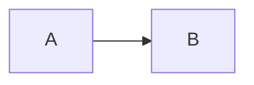

# 你好 😀 歡迎使用 Crossnote 交叉筆記

`@crossnote.auth "lng":"zh-TW"`

你很幸運 😆！你剛剛發現了一個 [0xGG Team](https://github.com/0xGG) 正在悄悄開發的網站。

**交叉筆記**是我在未來如果可能的話第一個想要商業化的項目。

你現在正在使用的這個編輯器是開源項目 [0xGG/VickyMD 微記](https://github.com/0xGG/VickyMD)，她基於 [@laobubu](https://github.com/laobubu) 的很酷的項目 [HyperMD](https://github.com/laobubu/HyperMD) 而構建而成。我希望 VickyMD 可以一直開源下去。並且未來我也會繼續開源一部分這個項目的前端和後端代碼。

我給予這個編輯器一個名字 **VickyMD**。關於這個編輯器，我擴展了 **HyperMD** 來支持更多的畫圖例如 [echarts](echartsjs.com)，[plantuml](http://plantuml.com/)，[vega](https://vega.github.io/vega/), [vega-lite](https://vega.github.io/vega-lite/)，以及 [wavedrom](https://wavedrom.com/)。同時，這個編輯器支持開發者來開發可自定義的組件，例如你上面看到的這個登錄/註冊組件。但是，未來我們有可能會重寫這個編輯器。

如果你曾經使用過 [Markdown Preview Enhanced](https://github.com/shd101wyy/markdown-preview-enhanced)，那麼你會發現我基本上移植了一些功能到這個網站（雖然還有很多沒有移植完成）。例如，你可以像在 MPE 裡面創建幻燈片一樣在這裡創建幻燈片。只需要插入 `<-- slide -->` 就行了。除此之外，你還可以創建各種各樣的圖表，KaTeX 數學，任務列表，腳註，等等。

**交叉筆記** 是基於 **VickyMD** 為核心編寫的。交叉筆記是一款 Markdown 筆記記錄平台，支持實時協作編輯，筆記/標籤管理，討論群，通知，等等。你可以很簡單地分享你的筆記給你的朋友或者大眾。你可以很簡單地通過一個鏈接向別人展示你的筆記。更多的特性將在未來開發完成。

**交叉筆記** 目前處於快速開發狀態，她的成產環境的網站只運行在位於洛杉磯的 Vultr 上的一個 8GB 內存的 VPS 上。這個產品目前還不穩定（基本上來講我寫的代碼越多，bugs 也越多哈哈），所以你的數據我不保證會被安全地儲存。**所以讓我重申一下：這個產品目前還沒有準備好**。但是我依舊會很高興如果你能幫我測試下。

更多酷拽炫的特性將被一個一個開發出來 ;) 讓我們保持聯繫。感謝你幫我測試這個產品。

如果你有問題或者特性請求，請發到[這裡](https://github.com/0xGG/Crossnote/issues)，如果我沒有及時回復還請見諒。

---

# 標題 1

## 標題 2

### 標題 3

#### 標題 4

##### 標題 5

###### 標題 6

`行內代碼`

```javascript
// 代碼塊
function add(x, y) {
  return x + y;
}
```

**粗體** and _斜體_ and ~~刪除~~

[鏈接到 crossnote issues](http://github.com/0xGG/crossnote_issues)

圖片：


KaTeX 數學：

$\left(\begin{array}{cc} \frac{1}{3} & x\\ {\mathrm{e}}^x & x^2 \end{array}\right)$

$$x^n + y^n = z^n$$

- [ ] Task lists
- [ ] Task lists 2

Mermaid：



PlantUML：

```plantuml
A -> B
```

Echarts：

```echarts
{"xAxis":{"type":"category","boundaryGap":false,"data":["Mon","Tue","Wed","Thu","Fri","Sat","Sun"]},"yAxis":{"type":"value"},"series":[{"data":[820,932,901,934,1290,1330,1320],"type":"line","areaStyle":{}}]}
```

Wavedrom：

```wavedrom
{"signal":[{"name":"clk","wave":"p......"},{"name":"bus","wave":"x.34.5x","data":"head body tail"},{"name":"wire","wave":"0.1..0."}]}
```

Vega：

```vega
{
  "$schema": "https://vega.github.io/schema/vega/v5.json",
  "width": 500,
  "height": 200,
  "padding": 5,

  "data": [
    {
      "name": "table",
      "values": [
        {"x": 0, "y": 28, "c": 0}, {"x": 0, "y": 55, "c": 1},
        {"x": 1, "y": 43, "c": 0}, {"x": 1, "y": 91, "c": 1},
        {"x": 2, "y": 81, "c": 0}, {"x": 2, "y": 53, "c": 1},
        {"x": 3, "y": 19, "c": 0}, {"x": 3, "y": 87, "c": 1},
        {"x": 4, "y": 52, "c": 0}, {"x": 4, "y": 48, "c": 1},
        {"x": 5, "y": 24, "c": 0}, {"x": 5, "y": 49, "c": 1},
        {"x": 6, "y": 87, "c": 0}, {"x": 6, "y": 66, "c": 1},
        {"x": 7, "y": 17, "c": 0}, {"x": 7, "y": 27, "c": 1},
        {"x": 8, "y": 68, "c": 0}, {"x": 8, "y": 16, "c": 1},
        {"x": 9, "y": 49, "c": 0}, {"x": 9, "y": 15, "c": 1}
      ],
      "transform": [
        {
          "type": "stack",
          "groupby": ["x"],
          "sort": {"field": "c"},
          "field": "y"
        }
      ]
    }
  ],

  "scales": [
    {
      "name": "x",
      "type": "band",
      "range": "width",
      "domain": {"data": "table", "field": "x"}
    },
    {
      "name": "y",
      "type": "linear",
      "range": "height",
      "nice": true, "zero": true,
      "domain": {"data": "table", "field": "y1"}
    },
    {
      "name": "color",
      "type": "ordinal",
      "range": "category",
      "domain": {"data": "table", "field": "c"}
    }
  ],

  "axes": [
    {"orient": "bottom", "scale": "x", "zindex": 1},
    {"orient": "left", "scale": "y", "zindex": 1}
  ],

  "marks": [
    {
      "type": "rect",
      "from": {"data": "table"},
      "encode": {
        "enter": {
          "x": {"scale": "x", "field": "x"},
          "width": {"scale": "x", "band": 1, "offset": -1},
          "y": {"scale": "y", "field": "y0"},
          "y2": {"scale": "y", "field": "y1"},
          "fill": {"scale": "color", "field": "c"}
        },
        "update": {
          "fillOpacity": {"value": 1}
        },
        "hover": {
          "fillOpacity": {"value": 0.5}
        }
      }
    }
  ]
}
```

Vega-lite：

```vega-lite
{
  "$schema": "https://vega.github.io/schema/vega-lite/v4.json",
  "description": "A simple bar chart with embedded data.",
  "data": {
    "values": [
      {"a": "A", "b": 28}, {"a": "B", "b": 55}, {"a": "C", "b": 43},
      {"a": "D", "b": 91}, {"a": "E", "b": 81}, {"a": "F", "b": 53},
      {"a": "G", "b": 19}, {"a": "H", "b": 87}, {"a": "I", "b": 52}
    ]
  },
  "mark": "bar",
  "encoding": {
    "x": {"field": "a", "type": "ordinal"},
    "y": {"field": "b", "type": "quantitative"}
  }
}

```
